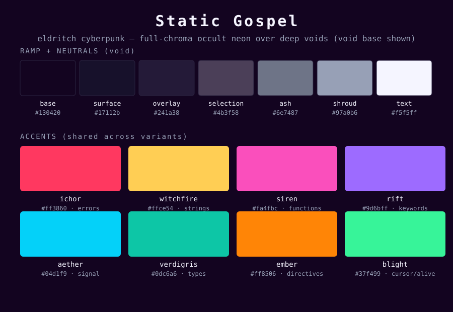
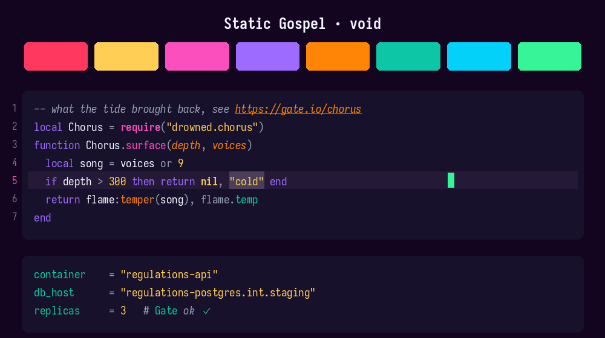
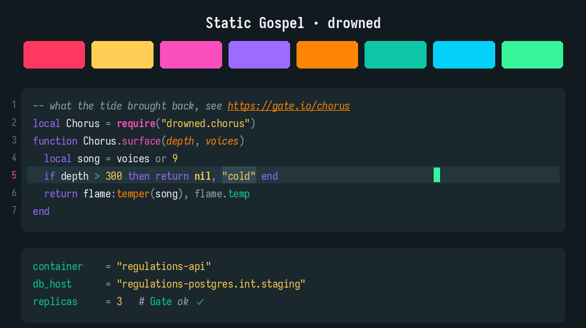
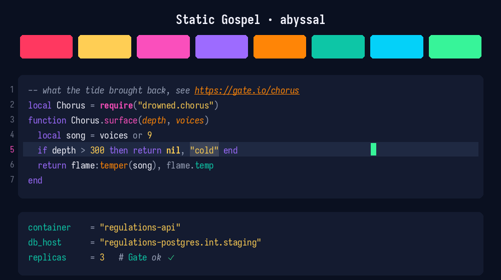
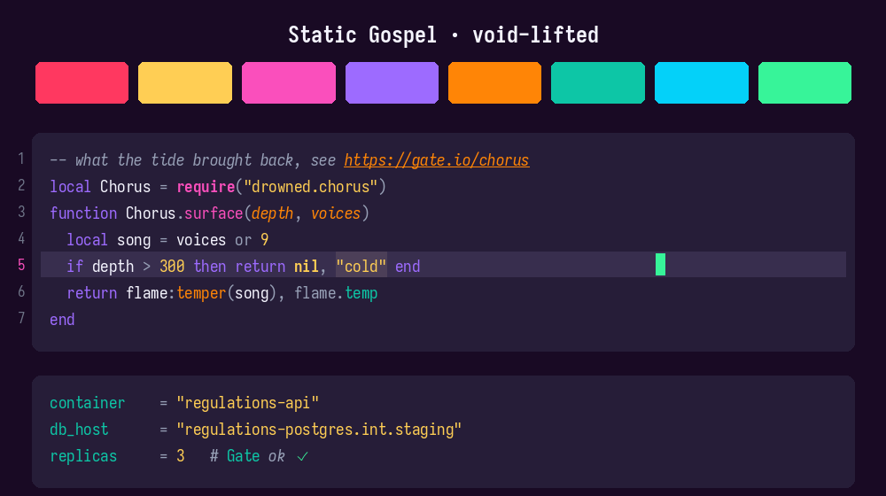

# Static Gospel

The dark theme I use for everything: near black backgrounds with the accents
turned way up. Covers nvim, terminals, git tools, the prompt and the WM. Five
variants, forked from [eldritch-rose](https://github.com/srlightbody/eldritch-rose)
when I turned the saturation up (that one's still muted).

## Palette



Accents are the same in every variant, only `base`/`surface`/`overlay`/grays
change. Table below is the **void** base.

| Role                | Hex       | Note                |
|---------------------|-----------|---------------------|
| base (bg)           | `#130420` | void                |
| surface             | `#17112b` | void                |
| overlay             | `#241a38` | void                |
| ash                 | `#6e7487` | steel neutral       |
| shroud              | `#97a0b6` | steel neutral       |
| text (fg)           | `#f5f5ff` |                     |
| ichor (errors)      | `#ff3860` | wound-red           |
| witchfire (strings) | `#ffce54` | forbidden gold      |
| siren (functions)   | `#fa4fbc` | magenta wound       |
| rift (keywords)     | `#9d6bff` | violet ritual       |
| aether (signal)     | `#04d1f9` | electric cyan       |
| verdigris (types)   | `#0dc6a6` | toxic teal          |
| ember (directives)  | `#ff8506` | signal orange       |
| blight / cursor     | `#37f499` | the one alive thing |
| selection (void)    | `#4b3f58` | violet tint         |

Nothing is toned down, so the colors are told apart by hue instead of
brightness. The green cursor and `aether` sit a step hotter so they always
read.

### 16-color ANSI (void)

```
normal   0 #26233a  1 #ff3860  2 #37f499  3 #ffce54  4 #9d6bff  5 #fa4fbc  6 #04d1f9  7 #dbdcf2
bright   8 #6e7487  9 #ff5c78 10 #69f8b3 11 #ffe08a 12 #b892ff 13 #ff86d4 14 #66e4fd 15 #f5f5ff
```

## Variants

Only the background ramp changes. **lifted** and **void-lifted** are drowned's
and void's with the floor raised ~5 L* and the steps widened, so the depth
survives on LCD and laptop panels instead of crushing to flat grey. Worth using
on anything that isn't OLED.

| Variant | base | feel |
|---------|-----------|-----------------------|
| void *(default)* | `#130420` | near-black violet, night city |
| drowned | `#111a1e` | teal deep, the sunken |
| abyssal | `#0a1020` | deep cosmic blue |
| lifted  | `#0c2126` | drowned, tuned for LCD |
| void-lifted | `#190a24` | void, tuned for LCD |






(lifted isn't pictured, it's drowned with a raised floor.)

**Neovim** picks the variant at runtime:

```lua
require("static-gospel").setup({ variant = "drowned" }) -- or abyssal, lifted, void-lifted (void is the default)
vim.cmd.colorscheme("static-gospel")
```

**Everything else** ships one file per variant next to the default (void), e.g.
`ghostty/static-gospel-drowned`, `bat/static-gospel-abyssal.tmTheme`,
`noctalia/colorschemes/Static Gospel Abyssal`, `brave/static-gospel-abyssal/`.
Point your app at that instead.

## Building

Every app file is generated from `palette.toml`. Don't hand edit them, edit
`palette.toml` (or `build/templates/*.tmpl` for structure) and rebuild:

```bash
python build/build.py            # regenerate every app file + palette.lua
python build/build.py check      # fail if any file is out of sync (CI/pre-commit)
python build/build.py templatize # rebuild templates from the void (default) files
python build/preview.py          # regenerate assets/preview-*.png (needs Pillow)
```

Only ten roles change per variant (`base`/`surface`/`overlay`/`_nc`, the three
highlight grays, `inactive_tab`/`border`/`selection`) plus the display name. A
new variant is a new `[variants.*]` block and a rebuild.

## Install

One file per app, no clone needed (except brave). Replace the raw URL base if
you fork it.

### Neovim

No dependencies, the plugin manager handles it. With lazy.nvim:

```lua
{
	"srlightbody/static-gospel",
	lazy = false,
	priority = 1000,
	config = function()
		vim.cmd.colorscheme("static-gospel")
	end,
}
```

packer:

```lua
use({ "srlightbody/static-gospel" })
-- then: vim.cmd.colorscheme("static-gospel")
```

### Ghostty

Drop it in ghostty's themes dir and point at it:

```sh
mkdir -p ~/.config/ghostty/themes
curl -fsSL https://raw.githubusercontent.com/srlightbody/static-gospel/main/ghostty/static-gospel \
	-o ~/.config/ghostty/themes/static-gospel
```

```
# ~/.config/ghostty/config
theme = static-gospel
```

Reload with `ctrl+shift+,` (or `cmd+shift+,` on macOS).

### Alacritty (0.13+)

```sh
mkdir -p ~/.config/alacritty/themes
curl -fsSL https://raw.githubusercontent.com/srlightbody/static-gospel/main/alacritty/static-gospel.toml \
	-o ~/.config/alacritty/themes/static-gospel.toml
```

```toml
# ~/.config/alacritty/alacritty.toml
[general]
import = ["~/.config/alacritty/themes/static-gospel.toml"]
```

### tmux

```sh
curl -fsSL https://raw.githubusercontent.com/srlightbody/static-gospel/main/tmux/static-gospel.conf \
	-o ~/.config/tmux/static-gospel.conf
```

```
# ~/.config/tmux/tmux.conf
source-file ~/.config/tmux/static-gospel.conf
```

Reload with `tmux source-file ~/.config/tmux/tmux.conf`.

### powerlevel10k

Overrides the colors in your existing `~/.p10k.zsh`, collapsing the rainbow
segments onto one bar with hot accent text. Source it after p10k's own config:

```sh
mkdir -p ~/.config/zsh
curl -fsSL https://raw.githubusercontent.com/srlightbody/static-gospel/main/p10k/static-gospel.zsh \
	-o ~/.config/zsh/static-gospel.zsh
```

```sh
# ~/.zshrc, after sourcing ~/.p10k.zsh
source ~/.config/zsh/static-gospel.zsh
```

### Brave / Chromium

Theme extension, so it needs the whole folder for the variant you want:

```sh
git clone https://github.com/srlightbody/static-gospel ~/.static-gospel
```

Open `brave://extensions` (or `chrome://extensions`), enable Developer mode, click
"Load unpacked", and select `~/.static-gospel/brave` for the default (void)
theme, or a variant subfolder (`brave/static-gospel-drowned`, `-abyssal`,
`-lifted`, `-void-lifted`). Each variant is a separate extension; to switch, load
the new one and disable the old on the extensions page.

### foot

```sh
curl -fsSL https://raw.githubusercontent.com/srlightbody/static-gospel/main/foot/static-gospel.ini \
	-o ~/.config/foot/static-gospel.ini
```

```ini
# ~/.config/foot/foot.ini
include=~/.config/foot/static-gospel.ini
```

### kitty

```sh
curl -fsSL https://raw.githubusercontent.com/srlightbody/static-gospel/main/kitty/static-gospel.conf \
	-o ~/.config/kitty/static-gospel.conf
```

```conf
# ~/.config/kitty/kitty.conf
include ./static-gospel.conf
```

### wezterm

```sh
mkdir -p ~/.config/wezterm/colors
curl -fsSL https://raw.githubusercontent.com/srlightbody/static-gospel/main/wezterm/static-gospel.toml \
	-o ~/.config/wezterm/colors/static-gospel.toml
```

```lua
-- wezterm.lua
config.color_scheme = "Static Gospel"
```

### bat

```sh
mkdir -p "$(bat --config-dir)/themes"
curl -fsSL https://raw.githubusercontent.com/srlightbody/static-gospel/main/bat/static-gospel.tmTheme \
	-o "$(bat --config-dir)/themes/static-gospel.tmTheme"
bat cache --build
```

```sh
# ~/.config/bat/config
--theme="static-gospel"
```

### delta

Needs the bat theme above (delta uses bat's syntax themes).

```sh
curl -fsSL https://raw.githubusercontent.com/srlightbody/static-gospel/main/delta/static-gospel.gitconfig \
	-o ~/.config/delta/static-gospel.gitconfig
```

```ini
# ~/.gitconfig
[include]
	path = ~/.config/delta/static-gospel.gitconfig
```

### lazygit

Layer it over your config so updates don't touch your own settings:

```sh
curl -fsSL https://raw.githubusercontent.com/srlightbody/static-gospel/main/lazygit/static-gospel.yml \
	-o ~/.config/lazygit/static-gospel.yml
```

```sh
# in your shell rc (rightmost file wins)
export LG_CONFIG_FILE="$HOME/.config/lazygit/config.yml,$HOME/.config/lazygit/static-gospel.yml"
```

### k9s

```sh
mkdir -p ~/.config/k9s/skins
curl -fsSL https://raw.githubusercontent.com/srlightbody/static-gospel/main/k9s/static-gospel.yaml \
	-o ~/.config/k9s/skins/static-gospel.yaml
```

```yaml
# ~/.config/k9s/config.yaml
k9s:
  ui:
    skin: static-gospel
```

### lsd

```sh
curl -fsSL https://raw.githubusercontent.com/srlightbody/static-gospel/main/lsd/static-gospel.yaml \
	-o ~/.config/lsd/colors.yaml
```

lsd only reads `colors.yaml`, so for a variant save its file (e.g.
`lsd/static-gospel-drowned.yaml`) to that same path.

### Noctalia

Drop it in noctalia's colorschemes folder and pick it in settings, noctalia
generates the per-terminal files itself:

```sh
mkdir -p ~/.config/noctalia/colorschemes
cp -r "noctalia/colorschemes/Static Gospel" ~/.config/noctalia/colorschemes/
```

## Notes

- The neovim theme vendors rose-pine/neovim's highlight engine (MIT, see
  LICENSE) and drives it off the palette above. No runtime dependency, and it
  can drift from rose pine.
- Syntax roles: keywords ride `rift` (violet ritual), functions `siren` (magenta
  wound), types/members/properties `verdigris` (toxic teal), strings/numbers
  `witchfire` (gold), errors `ichor` (wound-red), parameters/directives/links
  `ember` (signal orange).
- ANSI: 4/12 are the violet pair (`rift`, bright blue), 5/13 the pink pair
  (`siren`, bright magenta). `ember` and `verdigris` have no ANSI slot; nvim
  accents and the 16-color ANSI don't have to match.
- The accent keys (`ichor`/`witchfire`/`siren`/`rift`/`aether`/`blight`)
  carry over from eldritch-rose, which renamed rose pine's
  love/gold/rose/pine/foam/leaf. None of the colors are the same anymore, the
  names stuck. `umbra` (iris) was retired when the second violet became `ember`.
